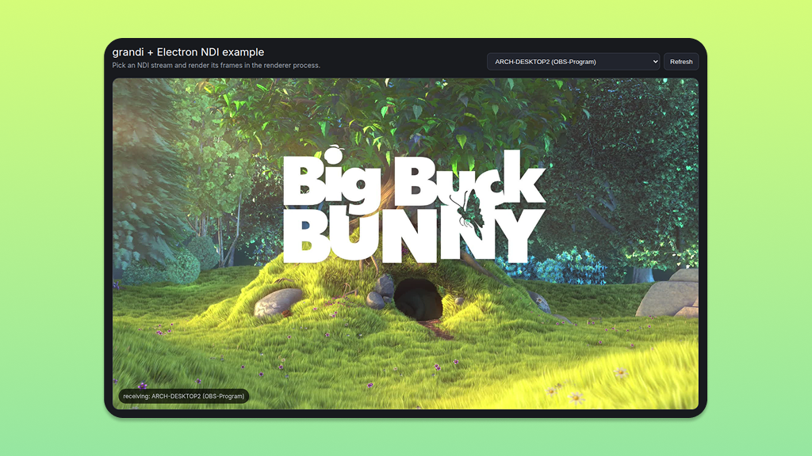
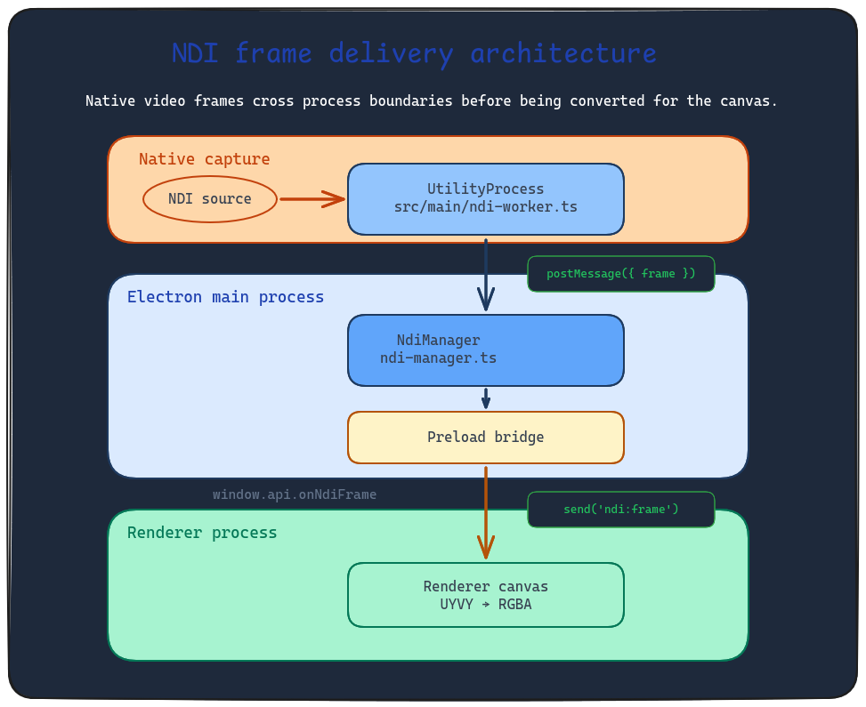

# electron-ndi-viewer

A minimal Electron example showing how to use [grandi](https://github.com/tux-tn/grandi) (Node.js NDI SDK bindings) inside an Electron app.

## How it works

- A dedicated **UtilityProcess** runs `src/main/ndi-worker.ts` in a separate child process.
- The worker loads grandi, discovers NDI sources on the network, and streams video frames (UYVY format) back to the main process via `parentPort.postMessage()`.
- `NdiManager` (in the main process) forwards frames to the renderer over IPC.
- The **React renderer** receives frames through a `contextBridge` API, converts UYVY→RGBA with an offscreen canvas, and draws onto a visible `<canvas>` element.

## Scripts

| Command               | Description                   |
| --------------------- | ----------------------------- |
| `npm run dev`         | Start dev server with HMR     |
| `npm run build`       | Typecheck + production build  |
| `npm run build:win`   | Build Windows installer       |
| `npm run build:mac`   | Build macOS DMG               |
| `npm run build:linux` | Build Linux AppImage/deb/snap |

## Cross-platform packaging

`npm run prepare:grandi` and the scripts under `scripts/` are only needed when **cross-building** — for example, building a Windows installer from Linux or macOS.

`grandi` ships platform-specific native addons as npm optional dependencies (`@grandi/win32-x64`, `@grandi/darwin-arm64`, etc.). npm only installs the variant matching the current host OS, so when cross-building, the target platform's package must be materialized manually.

The build scripts handle this automatically:

- `npm run build:win` runs `npm run prepare:grandi -- win32 x64` before building
- For other platforms, add the target: `npm run prepare:grandi -- darwin arm64`

See [electron-builder's cross-build documentation](https://www.electron.build/multi-platform-build) for setting up a cross-build environment.

### Why `asarUnpack` is needed

`@grandi/*` ships native Node addons, and those binaries must live on the real filesystem at runtime. Electron can load JavaScript from `app.asar`, but native `.node` modules and the copied `resources/**` payload cannot be executed or accessed reliably from inside the archive. `asarUnpack` ensures electron-builder places them under `app.asar.unpacked`, where the UtilityProcess and Node's native addon loader can actually read them.

### Optional dependency reference

| Target         | Package                |
| -------------- | ---------------------- |
| `win32 x64`    | `@grandi/win32-x64`    |
| `win32 ia32`   | `@grandi/win32-ia32`   |
| `darwin x64`   | `@grandi/darwin-x64`   |
| `darwin arm64` | `@grandi/darwin-arm64` |
| `linux x64`    | `@grandi/linux-x64`    |
| `linux arm64`  | `@grandi/linux-arm64`  |
| `linux armv7l` | `@grandi/linux-armv7l` |
